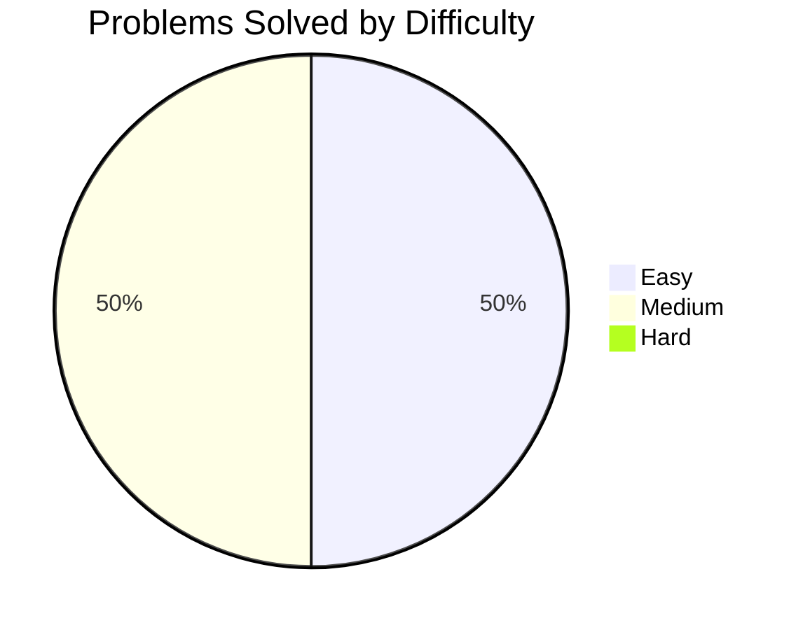

<h1> LeetPy</h1>

<em>Solving LeetCode problems using  .</em>

## 📈 Statistics

| Difficulty | Solved | LeetCode Total | Progress (%) | Visualization |
|------------|--------|----------------|--------------|----------------|
| [Easy](./difficulties/easy.md)   | <!-- EASY_SOLVED_COUNT -->9<!-- /EASY_SOLVED_COUNT -->     | 876  | <!-- EASY_PROGRESS_PERCENT -->1.0<!-- /EASY_PROGRESS_PERCENT -->  | <!-- EASY_PROGRESS_BAR -->░░░░░░░░░░░░░░░░░░░░░░░░<!-- /EASY_PROGRESS_BAR --> |
| [Medium](./difficulties/medium.md) | <!-- MEDIUM_SOLVED_COUNT -->9<!-- /MEDIUM_SOLVED_COUNT --> | 1840 | <!-- MEDIUM_PROGRESS_PERCENT -->0.5<!-- /MEDIUM_PROGRESS_PERCENT --> | <!-- MEDIUM_PROGRESS_BAR -->░░░░░░░░░░░░░░░░░░░░░░░░<!-- /MEDIUM_PROGRESS_BAR --> |
| [Hard](./difficulties/hard.md)   | <!-- HARD_SOLVED_COUNT -->0<!-- /HARD_SOLVED_COUNT -->     | 833  | <!-- HARD_PROGRESS_PERCENT -->0.0<!-- /HARD_PROGRESS_PERCENT -->  | <!-- HARD_PROGRESS_BAR -->░░░░░░░░░░░░░░░░░░░░░░░░<!-- /HARD_PROGRESS_BAR --> |
| **Total**   | <!-- TOTAL_SOLVED_COUNT -->**18**<!-- /TOTAL_SOLVED_COUNT --> | **3549** | <!-- TOTAL_PROGRESS_PERCENT -->**0.5**<!-- /TOTAL_PROGRESS_PERCENT --> | <!-- TOTAL_PROGRESS_BAR -->**░░░░░░░░░░░░░░░░░░░░░░░░**<!-- /TOTAL_PROGRESS_BAR --> |

---

## 📊 Solved Problems Distribution

